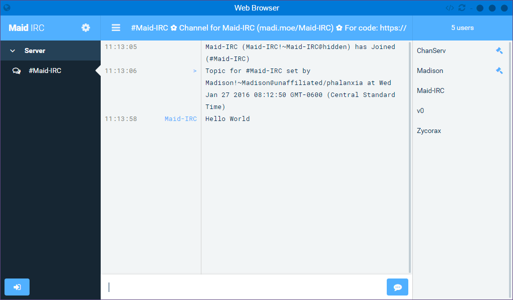

[](https://github.com/Phalanxia/Maid-IRC "Maid-IRC")
==

[](https://travis-ci.org/Phalanxia/Maid-IRC) [](https://www.npmjs.org/package/maid-irc) [](https://gemnasium.com/Phalanxia/Maid-IRC) [](https://www.npmjs.org/package/maid-irc) [](https://www.patreon.com/Phalanxia)

A modern web IRC client. Built on [Node](https://nodejs.org).

*Still in early development. Features and bugs may or may not be included.*

**[Screenshots](#screenshots) | [Building](#building) | [Running](#running) | [Community](#community) | [License](#license)**

---

## Screenshots




## Building

Don't feel like building? Prebuilt versions are available [here](https://github.com/Phalanxia/Maid-IRC/releases). Prebuilds are intended for production environments only and don't include files not necessary in production.

Before building, download and install the Node binaries from the official [Node.js site](https://nodejs.org/en/download/stable/).

**Note:** Maid-IRC requires Node.js v4.1.x or newer.

---

Install dependencies
```bash
$ npm install
```

Install grunt-cli
```bash
$ npm install -g grunt-cli
```

Compile .less files
```bash
$ grunt build:css
```
Compile public JavaScript with babel
```bash
$ grunt build:js
```

##### Optional:
Generating a production ready zip file
```bash
$ grunt package
```

## Running
```bash
$ node maid.js
```
**Recomended:** Look at 'config.js' and configure it to your liking.

**Optional:** (Not available in prebuilts) Please define the node environment variable. Supported variables are `development` and `production`. Will default to production if not defined.

## Community

Found a bug? Have a feature request? Please [submit an issue](https://github.com/Phalanxia/Maid-IRC/issues).

Need support? Wanna chat? Join our channel on the Freenode IRC network.

	HOST: irc.freenode.net
	CHANNEL: ##phalanxia

## License

[MIT License](LICENSE) © 2015 Madison Tries
